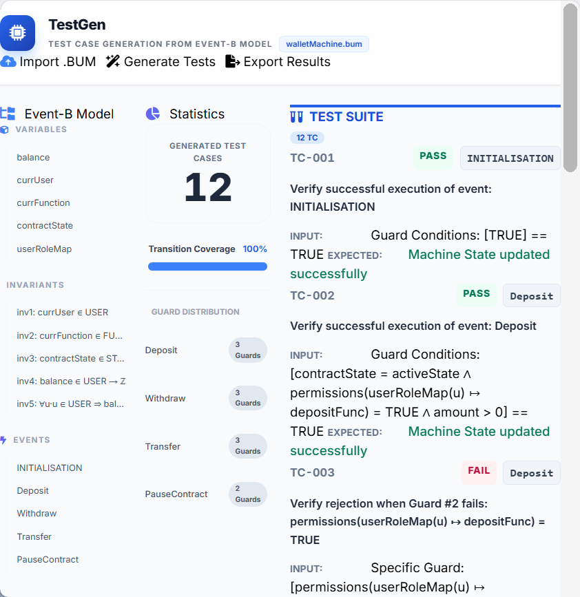

🛡️ Event-B TestGen: Smart Contract Analysis

Công cụ tự động sinh Test Case từ mô hình Event-B dành cho kiểm thử Smart Contract.

📖 Giới thiệu (Introduction)

Event-B TestGen là một công cụ web-based nhẹ nhàng giúp các nhà phát triển và kiểm thử viên phân tích các mô hình Event-B (thường dùng trong Smart Contracts). Công cụ này tự động phân tích file mô hình (.bum, .xml) và sinh ra các kịch bản kiểm thử (Test Cases) bao gồm cả trường hợp thành công (PASS) và trường hợp vi phạm điều kiện (FAIL/REVERT).

Dự án này giúp giảm thiểu thời gian viết test case thủ công và đảm bảo độ bao phủ các điều kiện (Guards) trong Smart Contract.

✨ Tính năng chính (Key Features)

📂 Import Model: Hỗ trợ nạp file mô hình Event-B (.bum hoặc .xml) trực tiếp từ máy tính.

🔍 Phân tích Cấu trúc: Tự động trích xuất và hiển thị trực quan:

Biến (Variables)

Bất biến (Invariants)

Sự kiện (Events) & Điều kiện bảo vệ (Guards)

⚡ Sinh Test Case Tự động:

PASS Case: Kiểm tra luồng thực thi thành công khi thỏa mãn tất cả Guards.

FAIL Case: Tự động tạo các kịch bản vi phạm từng Guard cụ thể (kiểm tra logic từ chối/revert của hợp đồng).

📊 Thống kê trực quan: Dashboard hiển thị số lượng Test Case, độ bao phủ chuyển đổi (Transition Coverage) và phân bố Guard.

💾 Xuất dữ liệu: Xuất trọn bộ Test Suite ra file .json (nén trong .zip) để sử dụng cho các bước kiểm thử tiếp theo.

🚀 Demo

Giao diện chính với các thống kê và danh sách Test Case

🛠️ Công nghệ sử dụng (Tech Stack)

Project được xây dựng hoàn toàn bằng Client-side (Frontend), không cần Backend server:

Core: HTML5, JavaScript (ES6+).

UI/UX: Tailwind CSS (Giao diện hiện đại, Responsive).

Icons: FontAwesome 6.

Libraries:

JSZip: Để đóng gói và xuất báo cáo.

DOMParser: Để phân tích cú pháp XML của file Event-B.

⚙️ Hướng dẫn sử dụng:

Nhấn nút "Import .BUM" ở góc trên bên phải.

Chọn file mô hình Event-B (định dạng .bum hoặc .xml) từ máy tính.

Nhấn "Generate Tests" để tool phân tích và sinh kịch bản.

Xem danh sách Test Case chi tiết ở cột bên phải.

Nhấn "Export Results" để tải về file báo cáo .zip.

📂 Cấu trúc thư mục

eventb-testgen/
├── index.html          # File chính chứa toàn bộ mã nguồn (UI + Logic)
├── README.md           # Tài liệu hướng dẫn dự án
└── assets/             # (Tùy chọn) Chứa hình ảnh demo

🤝 Đóng góp (Contributing)

Mọi đóng góp đều được hoan nghênh! Nếu bạn tìm thấy lỗi hoặc muốn cải tiến thuật toán sinh test, hãy:

Fork dự án.

Tạo branch mới (git checkout -b feature/NewFeature).

Commit thay đổi (git commit -m 'Add some NewFeature').

Push lên branch (git push origin feature/NewFeature).

Mở một Pull Request.

📝 License

Dự án này được phát hành dưới giấy phép MIT License.

Developed for Smart Contract Verification Course.